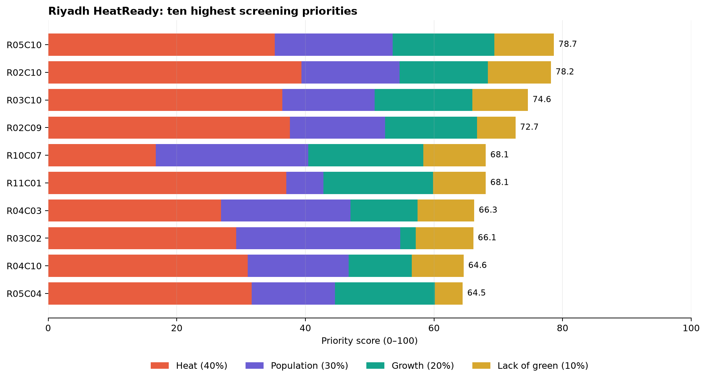

# Riyadh HeatReady

**Milkaholics | Urban Expansion, Land Use Change & Heat Risk | United Arab Emirates**

**One-line summary:** Riyadh HeatReady ranks 1 km zones in southeastern Riyadh where recent built-up growth, hot land surfaces, and modelled population overlap, so a municipal planning and heat-resilience team can decide where to inspect first.

## 1. Business use case

- **Intended user:** a municipal urban-planning and heat-resilience team.
- **Decision:** which zones should be inspected first for locally suitable measures such as shade, trees, cool roofs, or cool pavements?
- **Current practice:** no real user interview has been completed, so the current municipal process is unknown. The PoC tests whether joining separate growth, heat, population, and vegetation layers into one ranked list could make initial screening easier.
- **Product:** a self-contained dashboard plus CSV, GeoJSON, and GeoTIFF layers for review in an existing GIS workflow.

This is a screening aid. It does not automatically choose an intervention or make an official planning decision.

## 2. Problem, scale, and why satellite data

Rapid development and very hot surfaces can overlap, but planners need a short list of places to inspect rather than several disconnected maps. The PoC covers a **168.30 km²** urban-industrial fringe in southeastern Riyadh and compares change from **2018 to 2023** with heat and exposure context from **2025**.

Satellite data are core because they give repeatable, city-scale evidence of land cover, built structure, surface temperature, vegetation, and change. The project combines optical, radar, thermal, annual land-cover, population, and hyperspectral sources. The result could not be produced from the non-space data alone.

## 3. Data

All PoC inputs are open-access. Exact item IDs are in [`config.json`](config.json), and full licence notes are in [`docs/DATA_AND_LICENSES.md`](docs/DATA_AND_LICENSES.md).

| Product and provider | Dates used | Purpose and processing | Licence or terms |
|---|---:|---|---|
| Sentinel-2 L2A, Copernicus | 11 May 2018; 10 May 2021; 9 May 2025 | Cloud-aware optical reflectance and indices | Copernicus free, full, and open access |
| Sentinel-1 RTC, Microsoft Planetary Computer | 10 May 2018; 6 May 2021; 9 May 2025 | VV/VH radar structure used with optical features | CC BY 4.0 |
| Impact Observatory/Esri annual LULC | 2018–2023 | Annual built-area trend and candidate change | CC BY 4.0 |
| Landsat 8 Collection 2 Level-2, USGS | 10 May 2025 | Quality-masked land-surface temperature | United States public domain |
| ESA WorldCover | 2021 | Satellite-derived built reference for spatial holdout | CC BY 4.0 |
| WorldPop Global2 R2025A | 2025 | Modelled population per 1 km cell | CC BY 4.0 |
| Planet Tanager open urban archive | 15 May 2025 | Descriptive surface spectra and desert-confusion test | CC BY 4.0 |

The PoC does not use Satellite 813, commercial Planet imagery, gIQ, private city data, or restricted imagery.

## 4. Technical approach

1. Clip every source to the same Riyadh area and quality-mask invalid pixels.
2. Train an optical-radar built-up classifier in the west, tune it in a separate middle strip, and test it in the east against WorldCover.
3. Use six annual land-cover maps to propose 2018–2023 change.
4. Keep candidate growth only where separate 2025 Sentinel-2 and Sentinel-1 evidence also looks built-up.
5. Calculate 2025 Landsat land-surface temperature, WorldPop exposure, and Sentinel-2 vegetation context.
6. Rank eligible 1 km cells with a transparent score: **40% heat + 30% population + 20% confirmed growth + 10% lack of vegetation**.
7. Use one open Tanager scene only to compare surface spectra and test why a simple NDBI threshold is unsafe in bright desert.

The small notebook reproduces step 6 from committed example inputs. The full pipeline is in [`src/run_analysis.py`](src/run_analysis.py).

## 5. Installation

Use **Python 3.12** from the repository root.

```powershell
python -m venv .venv
.\.venv\Scripts\python.exe -m pip install -r requirements.txt
```

No secret key is required for the committed sample notebook. The full first run downloads open inputs, including a Tanager HDF5 scene of about 856 MB.

## 6. How to run

### Fast judge run: committed sample

Open [`notebooks/02_main_analysis.ipynb`](notebooks/02_main_analysis.ipynb), restart the kernel, and run all cells. No path or parameter needs to be changed. It reads `data/sample_input/riyadh_priority_drivers.csv` and writes:

- `results/example_priority_zones.csv`
- `results/example_priority_output.png`

The sample run normally finishes in under one minute on a standard laptop.

[](https://colab.research.google.com/github/Yusuf-Karanib/riyadh-heatready/blob/main/notebooks/02_main_analysis.ipynb)

### Complete satellite pipeline

```powershell
.\build_all.ps1
```

The complete run checks source availability, downloads and processes the exact scenes, runs the Tanager comparison, rebuilds the dashboard, verifies outputs, and creates the optional ZIP. Runtime depends mainly on connection speed and machine resources. Main interactive result: `outputs/dashboard.html`.

Submission presentation: [`output/pdf/Riyadh_HeatReady_PoC_Pitch.pdf`](output/pdf/Riyadh_HeatReady_PoC_Pitch.pdf). Editable source: [`slides/Riyadh_HeatReady_PoC_Pitch.pptx`](slides/Riyadh_HeatReady_PoC_Pitch.pptx).

## 7. Example input and output

The sample input contains **67 eligible 1 km cells** and the four normalized components produced by the full Earth-observation pipeline. It intentionally leaves out the final score and class so the notebook recalculates them. It contains no credentials, signed links, or restricted data.



The highest-ranked example is **R05C10**, with a score of about **78.7**. A planner would inspect it first and compare it with local plans and field conditions before choosing any action.

## 8. Results

- Annual mapped built area increased overall from **85.39 km² in 2018** to **98.03 km² in 2023**.
- The annual product proposed **13.82 km²** of candidate growth; the stricter optical-radar rule retained **3.74 km²**.
- Mean land-surface temperature on 10 May 2025 was **49.02 °C**; the 90th percentile was **51.71 °C**.
- Modelled 2025 population inside the area was approximately **594,902**.
- The spatial east-side holdout reached **F1 0.88**, **IoU 0.78**, and **balanced accuracy 0.89** against WorldCover.
- **14 of 67** eligible cells were labelled High priority.

These are PoC outputs, not official city statistics.

## 9. Validation, assumptions, and limitations

- The holdout measures agreement with another satellite product, not independent field accuracy.
- Land-surface temperature is not air temperature or personal heat exposure.
- WorldPop is a modelled estimate, not a live census or industrial worker count.
- Bright roofs, compacted soil, and bare desert can confuse built-up classification.
- The 2022 annual-map dip shows that the time series is supporting evidence, not an exact construction register.
- The one-date Tanager scene adds spectral context but cannot prove change.
- Priority weights and percentile thresholds are PoC assumptions that a real user must review.
- No user-validation bonus is claimed because no interviews with three real users or stakeholders have been completed.

## 10. Team, licence, and attribution

- **Team:** Milkaholics.
- **Yusuf Karanib:** registered team leader and presenter.
- A second account is currently registered on the portal. Its role or contribution is not claimed here and must be confirmed before submission.
- **Code licence:** not yet selected by the repository owner. Until a licence is added, normal copyright protection applies. Dataset licences remain separate.

Attribution: Contains modified Copernicus Sentinel data (2018, 2021, 2025), Sentinel-1 RTC data hosted by Microsoft, USGS Landsat Collection 2 Level-2 data, Impact Observatory/Esri annual land-cover data, and WorldPop 2025 data. © ESA WorldCover project 2021 / Contains modified Copernicus Sentinel data (2021) processed by ESA WorldCover consortium. Adapted from Tanager STAC Data, available at www.planet.com/data/stac © 2025 Planet Labs PBC. All Rights Reserved.
